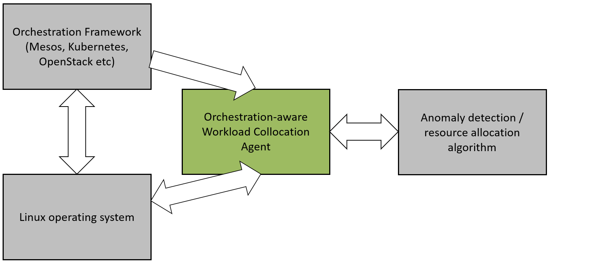
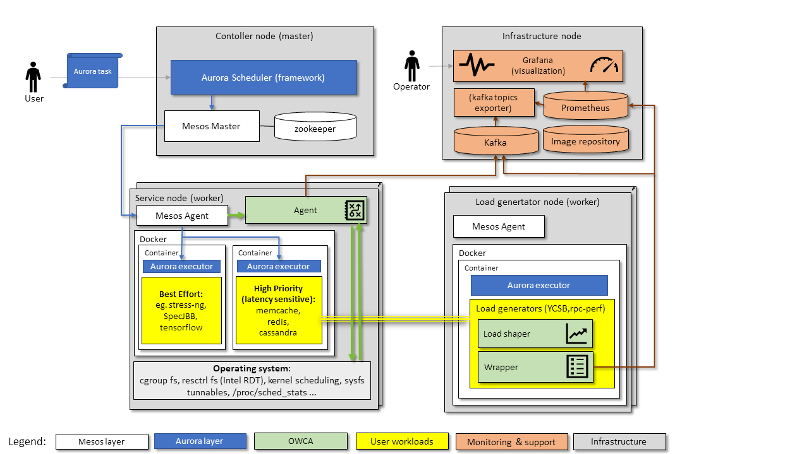

=====================================================
OWCA - Orchestration-Aware Workload Collocation Agent
=====================================================

.. image:: https://travis-ci.com/intel/owca.svg?branch=master
    :target: https://travis-ci.com/intel/owca

.. contents:: Table of Contents

**This software is pre-production and should not be deployed to production servers.**

Introduction
============

Orchestration-aware Workload Collocation Agent goal is to reduce interference between collocated tasks and increase tasks density while ensuring the quality of
service for high priority tasks. Chosen approach is to enable real-time resource isolation management
to ensure that high priority jobs meet their Service Level Objective (SLO) and best-effort jobs
effectively utilize as many idle resources as possible.

Resource usage can be increased by:

- collocating best effort and high priority tasks to exploit resources that are underutilized by high priority applications,
- collocating tasks that do not compete for shared resources on the platform.

OWCA abstracts compute node, workloads, monitoring and resource allocation.
An externally provided algorithm is responsible for allocating resources or anomaly detection logic. OWCA
and the algorithm exchange information about current resource usage, isolation actuations or detected
anomalies. OWCA stores information about detected anomalies, resource allocation and platform utilization metrics to a remote storage such as Kafka.

The diagram below puts OWCA in context of an example Mesos cluster and monitoring infrastructure:

See `OWCA Architecture 1.5.pdf`_ for futher details.

Getting started
===============

------------

OWCA is targeted at and tested on Centos 7.5.

*Note*: for full production installation please follow this detailed `installation guide <docs/install.rst>`_.

.. code-block:: shell

    # Install required software.
    sudo yum install epel-release -y
    sudo yum install git python36 -y
    python3.6 -m ensurepip --user
    python3.6 -m pip install --user pipenv

    # Clone the repository & build.
    git clone https://github.com/intel/owca
    cd owca
    pipenv install --dev
    make

    # Run manually (alongside Mesos agent):
    sudo dist/owca.pex --config configs/mesos_example.yaml --root

Configuration
=============

OWCA introduces simple but extensible mechanism to inject dependencies into classes and build complete software stack of components. 
OWCA main control loop is based on ``Runner`` base class that implements
single ``run`` blocking method. Depending on ``Runner`` class used, the OWCA is run in different execution mode (e.g. detection,
allocation).

Examples runners:

- ``DetectionRunner`` implements the loop calling ``detect`` function in
  regular and configurable intervals. See `detection API <docs/detection.rst>`_ for details.
- ``AllocationRunner`` (Work in progress) implements the loop calling ``allocate`` function in
  regular and configurable intervals. See `allocation API <docs/allocation.rst>`_ for details.

Conceptually ``Runner`` reads a state of the system (both metrics and workloads),
passes the information to external component (an algorithm), logs the algorithm input and output using implementation of  `Storage <owca/storage.py>`_
and allocates resources if instructed.

Following snippet is an example configuration of a runner:

.. code-block:: yaml

    runner: !SomeRunner
        node: !SomeNode
        callback_component: !ClassImplementingCallback
        storage: !SomeStorage

After starting OWCA with the above mentioned configuration, an instance of the class ``SomeRunner`` will be created. The instance's properties will be set to:

- ``node`` - to an instance of ``SomeNode``
- ``callback_component`` - to an instance of ``ClassImplementingCallback``
- ``storage`` - to an instance of ``SomeStorage``

Configuration mechanism allows to:

- Create and configure complex python objects (e.g. ``DetectionRunner``, ``MesosNode``, ``KafkaStorage``) using `YAML tags`_.
- Inject dependencies (with type checking support) into constructed objects using `dataclasses <https://docs.python.org/3/library/dataclasses.html>`_ annotations.
- Register external classes using ``-r`` command line argument or by using ``owca.config.register`` decorator API.

.. _`YAML tags`: http://yaml.org/spec/1.2/spec.html#id2764295

See `external detector example <docs/extrenal_detector_example.rst>`_ for more details.

Following built-in components are available:

- `MesosNode <owca/mesos.py>`_ provides workload discovery on Mesos cluster node where `mesos containerizer <http://mesos.apache.org/documentation/latest/mesos-containerizer/>`_ is used.
- `DetectionRunner <owca/runner.py>`_ implements anomaly detection loop and encodes anomalies as metrics to enable alerting and analysis. See `Detection API <docs/detection.rst>`_ for more details.
- `AllocationRunner <owca/runner.py>`_ implements resource allocation loop.See `Allocation API <docs/allocation.rst>`_ for more details (Work in progress).
- `NOPAnomalyDetector <owca/detectors.py>`_ dummy "no operation" detector that returns no metrics, nor anomalies. See `Detection API <docs/detection.rst>`_ for more details.
- `KafkaStorage <owca/storage.py>`_ logs metrics to  `Kafka streaming platform <https://kafka.apache.org/>`_ using configurable topics 
- `LogStorage <owca/storage.py>`_ logs metrics to standard error or to a file at configurable location.

Workloads
=========

The project contains Dockerfiles together with helper scripts aimed at preparation of reference workloads to be run on Mesos cluster using Aurora framework.

To enable anomaly detection algorithm validation the workloads are prepared to:

- provide continuous stream of Application Performance Metrics using `wrappers <docs/wrappers.rst>`_ (all workloads),
- simulate varying load (patches to generate sine-like pattern of requests per second are available for `YCSB <workloads/ycsb/intel.patch>`_ and `rpc-perf <workloads/rpc_perf/intel_rpc-perf-ratelimit.patch>`_ ).
  

See `workloads directory <workloads>`_ for list of supported applications and load generators.

Further reading
===============

- `Installation guide <docs/install.rst>`_
- `Detection API <docs/detection.rst>`_
- `Allocation API <docs/allocation.rst>`_
- `Development guide <docs/development.rst>`_
- `External detector example <docs/external_detector_example.rst>`_
- `Wrappers guide <docs/wrappers.rst>`_
- `Logging configuration <docs/logging.rst>`_
- `Supported workloads and definitions </workloads>`_
- `OWCA Architecture 1.5.pdf`_

.. _`OWCA Architecture 1.5.pdf`: docs/OWCA_Architecture_v1.5.pdf

