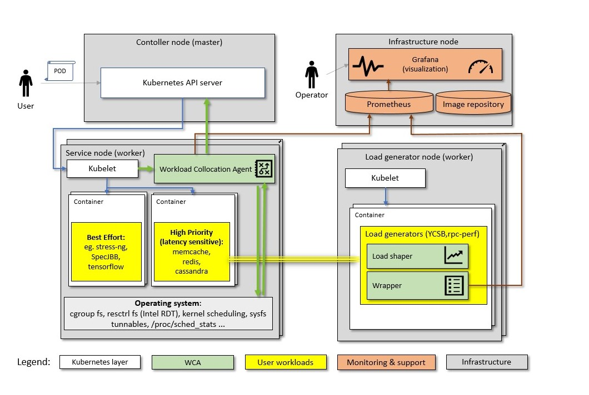

======================
Kubernetes integration
======================

**This software is pre-production and should not be deployed to production servers.**

.. contents:: Table of Contents

Introduction
============

The diagram below puts Kubernetes integration in context of a cluster and monitoring infrastructure:

Kubernetes supported features
=============================

- Monitoring
- Allocation

:Note: In allocation mode, because of Kubernetes internal reconcillation  loop for resource managment (`--sync-frequency <https://kubernetes.io/docs/reference/command-line-tools-reference/kubelet/>`_ defaults to 60s), it is required from Allocator class to repeat desired allocations in every iteration. This will be fixed in future versions.

Kubernetes restrictions
=======================

- Kubernetes version >= 1.13.x,
- cgroup driver: `systemd` or `cgroupfs`.

Possible wca configuration options
==================================
In wca configuration file one can set below listed parameters.
Please refer to `example configuration file for kubernetes <../configs/kubernetes/kubernetes_example_allocator.yaml>`_.

.. code-block:: python

    class CgroupDriverType(str, Enum):
        SYSTEMD = 'systemd'
        CGROUPFS = 'cgroupfs'

    @dataclass
    class KubernetesNode(Node):
        # We need to know what cgroup driver is used to properly build cgroup paths for pods.
        #   Reference in source code for kubernetes version stable 1.13:
        #   https://github.com/kubernetes/kubernetes/blob/v1.13.3/pkg/kubelet/cm/cgroup_manager_linux.go#L207
        cgroup_driver: CgroupDriverType = field(
            default_factory=lambda: CgroupDriverType(CgroupDriverType.CGROUPFS))

        # By default use localhost, however kubelet may not listen on it.
        kubelet_endpoint: str = 'https://127.0.0.1:10250'

        # Key and certificate to access kubelet API, if needed.
        client_private_key: Optional[str] = None
        client_cert: Optional[str] = None

        # List of namespaces to monitor pods in.
        monitored_namespaces: List[str] = field(default_factory=lambda: ["default"])

Run wca as DaemonSet on cluster
===============================
Reference configs are in `example configuration file for kubernetes <../examples/kubernetes/monitoring>`_.

1. Add namespace 'wca'

Namespace can be crated by following command:

.. code-block:: bash

    kubectl create namespace wca

or

.. code-block:: bash

    kubectl apply -f manifest/namespace.yaml

2. Add private key and certificate to Secrets

Workload Collocation Agent required private key and certificate to connect with kubelet.
Example how add this files to Secrets:

.. code-block:: bash

    sudo kubectl create secret generic kubelet-key-crt --from-file=./client.crt --from-file=./client.key --namespace=wca

3. Add configuration file to ConfigMap

Workload Collocation Agent requires configuration file.
`Example Allocator as ConfigMap <../example/manifest/configmap.yaml>`_. To create the resource run:

.. code-block:: bash

    kubectl apply -f manifest/configmap.yaml

4. Build Docker image

Build `Docker image <../Dockerfile>`_ and push to private repo. Then specify image inside
the daemonset podspec to the pushed image.
`Example definition DaemonSet <../example/manifest/daemonset.yaml>`_.

5. Run DaemonSet

Use command below to create DaemonSet:

.. code-block:: bash

    kubectl apply -f manifest/daemonset.yaml

Task's metrics labels for Kubernetes
====================================
Task metrics (e.g. cycles, cache_misses_per_kilo_instructions) have labels which are generated in the manner:

- pod's label sanitized (replaced '.' with '_'),
- additional label **task_name** which value is created by joining pod namespace and pod name (e.g. 'default/stress_ng'),
- additional label **task_id** which value is equal to pod identifier.

Task's resources for Kubernetes
===============================
List of available resources:

- disk
- mem
- cpus
- limits_mem
- limits_cpus
- requests_mem
- requests_cpus

Task resources "disk" and "mem" are scalar values expressed in bytes. Fractional "cpus" values correspond to partial shares of a CPU.
They are calculated from containers spec (https://kubernetes.io/docs/concepts/configuration/manage-compute-resources-container/#meaning-of-memory).
``limits_*`` and ``requests_*`` are added according to k8s documentation (https://kubernetes.io/docs/concepts/configuration/manage-compute-resources-container/#resource-requests-and-limits-of-pod-and-container).
