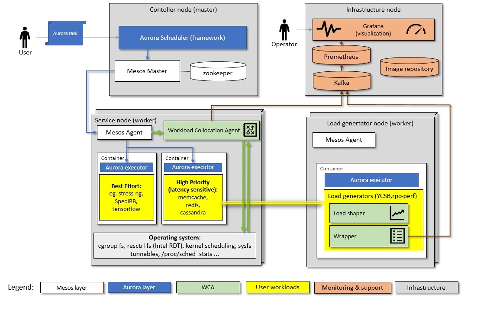

=================
Mesos integration
=================

**This software is pre-production and should not be deployed to production servers.**

.. contents:: Table of Contents

Introduction
============

The diagram below puts Mesos integration in context of a cluster and monitoring infrastructure:

Mesos supported features
========================

- Monitoring
- Allocation

Mesos restrictions
==================

- Mesos version >= 1.2.x,
- `Mesos containerizer <http://mesos.apache.org/documentation/latest/containerizers/#Mesos>`_,
- `Tasks groups <http://mesos.apache.org/documentation/latest/nested-container-and-task-group/>`_ are currently not supported.

Required agent options
------------------------------

- ``containerizers=mesos`` - to enable PID based cgroup discovery,
- ``isolation=cgroups/cpu,cgroups/perf_event`` - to enable CPU shares management and perf event monitoring,
- ``perf_events=cycles`` and ``perf_interval=360days`` - to enable perf event subsystem cgroup management without actual counter collection.

Following exact setup was verified to work with provided `workloads </workloads>`_:

- Mesos version == 1.2.6
- Docker registry V2
- Aurora framework version == 0.18.0

Mesos agent was configured with non-default options:

- ``perf_events=cycles``
- ``perf_interval=360days``
- ``isolation=filesystem/linux,docker/volume,docker/runtime,cgroups/cpu,cgroups/perf_event``
- ``cgroups_enable_cfs=true``
- ``hostname_lookup=false``
- ``image_providers=docker``
- ``attributes/own_ip=HOST_IP``

Possible configuration options
==============================
In WCA configuration file one can set below listed parameters.
Please refer to `example configuration file for mesos <../configs/mesos/mesos_external_detector.yaml>`_.

.. code-block:: python

    @dataclass
    class MesosNode(Node):
        mesos_agent_endpoint: Url = 'https://127.0.0.1:5051'

        # Timeout to access mesos agent.
        timeout: Numeric(1, 60) = 5.  # [s]

        # https://github.com/kennethreitz/requests/blob/5c1f72e80a7d7ac129631ea5b0c34c7876bc6ed7/requests/api.py#L41
        ssl: Optional[SSL] = None

        METHOD = 'GET_STATE'
        api_path = '/api/v1'

Task's metrics labels for Mesos
===============================
Task metrics (e.g. cycles, cache_misses_per_kilo_instructions) have labels which are generated in the manner:

- task's label sanitized (replaced '.' with '_', removed prefixes like 'org.aurora'),
- additional label **task_name** which value is equal to task name (for Aurora e.g. 'example/root/staging/stress_ng'),
- additional label **task_id** which value is equal to task id.